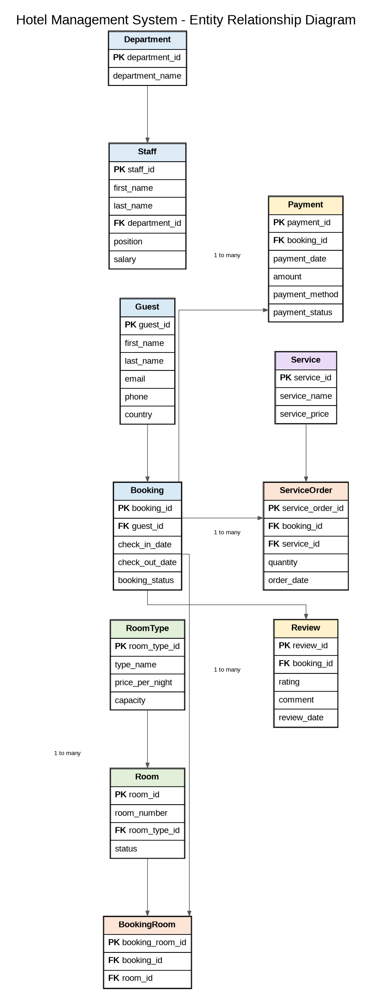
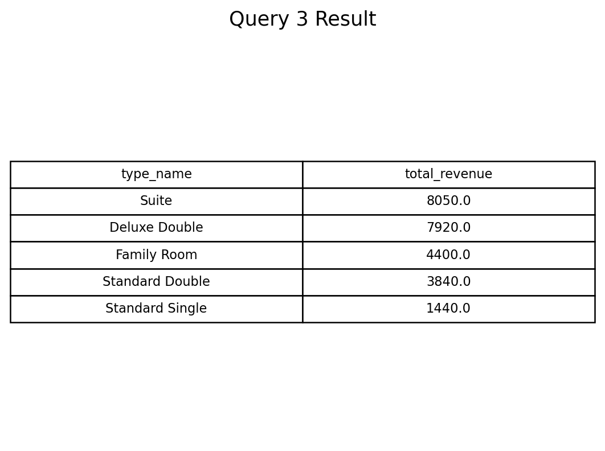

# Hotel Management System SQL Project

## Overview

This project implements a relational database for a hotel management system using SQL. The database manages hotel operations including guests, rooms, bookings, payments, staff, departments, services, service orders and customer reviews.

The project demonstrates relational database design and practical SQL analysis through a realistic academic project scenario.

## Project Objectives

- Design a relational database using SQL
- Build relationships with primary and foreign keys
- Insert sample data into multiple related tables
- Perform business-oriented SQL queries
- Demonstrate SQL techniques for data analysis

## Database Structure

| Table | Description |
|------|-------------|
| Guest | Guest information |
| RoomType | Room categories and pricing |
| Room | Individual hotel rooms |
| Booking | Booking information |
| BookingRoom | Relationship between bookings and rooms |
| Payment | Payment records |
| Department | Hotel departments |
| Staff | Employee information |
| Service | Hotel services |
| ServiceOrder | Service orders placed by guests |
| Review | Customer reviews |

## Entity Relationship Diagram



## SQL Skills Demonstrated

- Database Design
- Primary Keys & Foreign Keys
- CREATE TABLE
- INSERT INTO
- SELECT
- WHERE
- ORDER BY
- INNER JOIN
- LEFT JOIN
- GROUP BY
- HAVING
- Aggregate Functions
- Subqueries
- CASE WHEN
- Common Table Expressions
- Window Functions
- VIEW

## Project Structure

```text
Hotel-Management-System-SQL/
│
├── README.md
├── Assignment.md
├── schema.sql
├── insert_data.sql
├── queries.sql
├── results.md
├── ERD/
│   └── ER_Diagram.png
└── screenshots/
    ├── Query1.png
    ├── Query2.png
    ├── ...
    └── Query10.png
```

## Example Query Result



## Files

- `schema.sql`: creates database tables and relationships
- `insert_data.sql`: inserts sample hotel management data
- `queries.sql`: contains 10 SQL queries with questions and comments
- `results.md`: shows the output of each SQL query
- `ERD/ER_Diagram.png`: database relationship diagram
- `screenshots/`: query result screenshots

## Author

Developed as an academic SQL database project to demonstrate relational database design and SQL data analysis skills.
